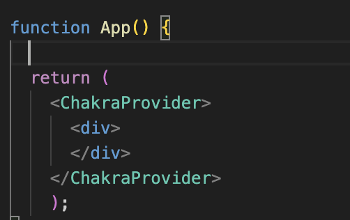
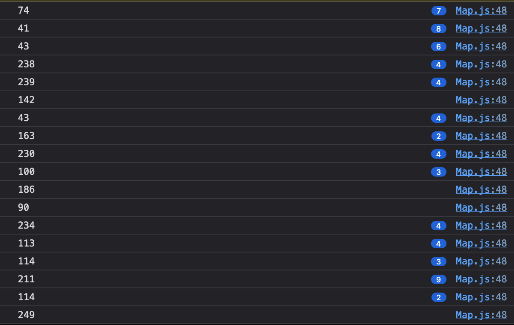

# Part 1: Setting up React #

## 1.1: Setting up our Folder Structure ##

- We will need to have npm to start our react project.
- We must install Node.js and the npm command line interface
- npm is used to download JavaScript packages from Node Package Manager
- npx is used to execute JavaScript packages downloaded this way
  
``` 
npm install -g npm
```

- Once we have Node.js and npm set up we can begin to create our react app

### Create our React app ###

``` 
npx create-react-app 'coffee-compass'
```
The prior command creates a directory named coffee-compass in our curent folder we are cd'ed into. 

``` 
coffee-compass
├── README.md
├── node_modules
├── package.json
├── .gitignore
├── public
│   ├── favicon.ico
│   ├── index.html
│   ├── logo192.png
│   ├── logo512.png
│   ├── manifest.json
│   └── robots.txt
└── src
    ├── App.css
    ├── App.js
    ├── App.test.js
    ├── index.css
    ├── index.js
    ├── logo.svg
    ├── serviceWorker.js
    └── setupTests.js
```

Once we are cd'ed into our project directory we can start the app

```
npm start
```


- In the src folder we will create a componenets folder to hold all our react componeents  

## 1.3 Importing a UI Library ## 
- We will use Chakra UI 
- https://chakra-ui.com/getting-started/cra-guide 
- First we install chakra ui 
``` 
npm i @chakra-ui/react @emotion/react @emotion/styled framer-motion 
```
- For chakra-ui  to work we must set up the ChakraProvider component at the root of our app like so:



# Part 2: Setting up the Map #
## 2.1: Installing Mapbox ##
- We are using Mapbox GL JS, a javascript library for building web maps.
- We made an account on mapbox.com  to get access to an api key
- In our package.json file we added the following code in order for our project to install the correct dependencies for the react map. 
```  
{
  "name": "use-mapbox-gl-js-with-react",
  "version": "0.1.0",
  "private": true,
  "dependencies": {
    "mapbox-gl": "^2.14.1",
    "react": "^17.0.2",
    "react-dom": "^17.0.2",
    "react-scripts": "^4.0.3"
  },
  "scripts": {
    "start": "react-scripts start",
    "build": "react-scripts build"
  },
  "eslintConfig": {
    "extends": [
      "react-app"
    ]
  },
  "browserslist": [
    "defaults",
    "not ie 11"
  ],
  "author": "Mapbox",
  "license": "MIT"
}
``` 
- We then run the following command in the root of our project directory in order to install all the dependencies in package.json
  
``` 
  npm install
``` 

## 2.2: Importing our Map ##

- In order to get the map displayed onto our page we must import the needed files into index.js and app.js
- For index.js we import the following:
``` 
import React from 'react';
import ReactDOM from 'react-dom';
import 'mapbox-gl/dist/mapbox-gl.css';
import './index.css';
import App from './App';
 
ReactDOM.render(
<React.StrictMode>
<App />
</React.StrictMode>,
document.getElementById('root')
);
```

- for app.js we have the following imports:
```
import React, { useRef, useEffect, useState } from 'react';
import mapboxgl from '!mapbox-gl'; // eslint-disable-line import/no-webpack-loader-syntax
```  

- We then have to set the value of mapbox.accessToken  to our access token 
``` 
  mapboxgl.accessToken = 'our access token is here';
``` 
our access token should be imported from another file so it is not readable on our website. 

## 2.3: Setting up our maps default state ##
- We will create a map componenet and move all the prior imports and access token to our map.js file.
- First we must create defaults for our map to set up the initial coordinates and zoom:
  ``` 
    const mapContainer = useRef(null);
    const map = useRef(null);
    const [lng, setLng] = useState(-73.9712);
    const [lat, setLat] = useState(40.7831);
    const [zoom, setZoom] = useState(11.25);
  ```
- The coordinates are set to Manhattan, NYC
- Next we create a use effect function to initialize our map
``` 
      useEffect(() => {
        if (map.current) return; // initialize map only once
        map.current = new mapboxgl.Map({
            container: mapContainer.current,
            style: 'mapbox://styles/mapbox/dark-v11',
            center: [lng, lat],
            zoom: zoom
        });
        });
```
- Finally we return the map object so it displays on our web page when we call the Map componenet on app.js
```  
return (
<div>
<div ref={mapContainer} className="map-container" />
</div>
);
``` 
- When displayed on our page the map currently looks like this


## 2.3: Adding Layers to our Map ## 
- We use the mapbox function of addsource and addlayer to incorporate our geospatial data on the map
- We took the geospatial data from https://data.cityofnewyork.us/Transportation/NYC-Taxi-Zones/d3c5-ddgc 
- We exported a geojson file that has all the taxi zones in NYC


- We changed the color of our layer and it shows all taxi zones in NYC
- We only want taxi zones in Manhattan 
- After looking at the .geojson file we saw that each taxi zone had a borough associated with it
- We created a python program that fitlers the json file by Manhattan and creates a new geojson file
```
import json

# Load the GeoJSON file
with open('/Users/maxgirt/coffee-compass/public/NYC_Taxi_Zones.geojson') as file:
    data = json.load(file)

# Filter features based on the borough
filtered_features = [feature for feature in data['features'] if feature['properties']['borough'] == 'Manhattan']

# Create a new GeoJSON object with the filtered features
filtered_data = {
    'type': 'FeatureCollection',
    'features': filtered_features
}

# Save the filtered GeoJSON to a new file
with open('filtered_geojson_file.geojson', 'w') as file:
    json.dump(filtered_data, file)
```

- Now our map only has a layer over manhattan
  


## 2.4: Adding a hover effect ##
- We want to add a hover effect so that when the mouse hovers above a specific zone that zone will change color 
- We have to look at the json object to see how to different between different zones:
  - To look at the json object I used a mapbox function so that on mousemove over a zone it would return the current object:

- We also want to console log the specific objectId of each zone to make sure it is changing when our mouse moves over a different zone
- We can see that when we console log the objectId it changes depending on what zone our mouse is on
  

- This confirms that we want to change the color of a specific zone based on its objectId
- We used this tutorial for getting the hover effect: https://docs.mapbox.com/mapbox-gl-js/example/hover-styles/
- First I added a  mouseenter event listener to change zone color on hover
- We used the mousemove event (when we used mouseover the hovered zones would not change...)
- Once the id of the current zone is logged we can change the color of that specific zone using mapboxes setPaintProperty function  
- We compare the objectId of the current hovered zone and if the color is the same as the zone we are on we change the color to make a hover-effect appear 
```
        // Add mouseenter event listener to change zone color on hover
        map.current.on('mousemove', 'taxi_zones_fill', (e) => {
            var hoveredZone = e.features[0].properties.objectid; // Get the ID of the hovered zone
            // console.log(e.features[0]);
            console.log(hoveredZone);
            // Change fill color only for the hovered zone
            map.current.setPaintProperty('taxi_zones_fill', 'fill-color', [
                'match',
                ['get', 'objectid'],
                hoveredZone,
                '#00ff00', // Color for the hovered zone
                '#ff0000' // Default color for other zones
            ]);
            });  
```

- Next we need to remove the hover from that specific zone when the mouse leaves that zone
- We use a mouseleave effect function to make all zones of the map the original color except for the currently highlighted zone. 
``` 
map.current.on('mouseleave', 'taxi_zones_fill', () => {
    map.current.setPaintProperty('taxi_zones_fill', 'fill-color', '#ff0000'); // Reset fill color for last zone
});
```

-  This is our end result:


## 2.5: Adding a zoom effect on click ##
- We want our map  to zoom in on a zone to click when a zone is clicked on
- To do this we access the json object to get the lat/lng of the zone we clicked on
- Then we use the map.flyTo function to move the map's center to wherever the mouseclick is and zoom in on that center 
  
```
map.current.flyTo({ center: lngLat, zoom: 14 }); // Zoom in to the clicked point
``` 


